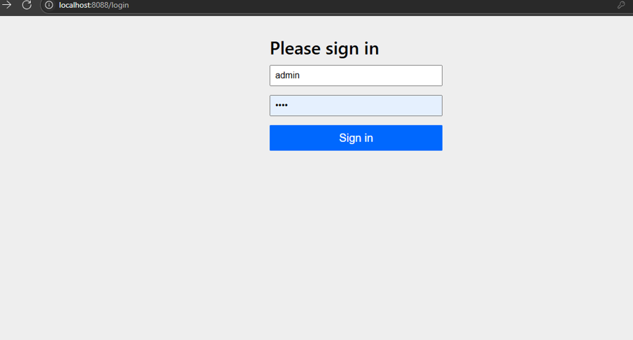

## Activité Pratique N°5 : Products Management avec Spring MVC

### 🔖 1. Présentation Générale

Le projet **Products Management** est une application web réalisée avec **Spring Boot** et **Thymeleaf**, permettant de
gérer des produits (recherche, ajout, modification, suppression). Il met également en œuvre une couche de sécurité basée
sur les rôles `USER` et `ADMIN`, permettant de restreindre l'accès à certaines fonctionnalités.

---

### 🗂️ 2. Structure du Projet

```
src/
└── main/
    ├── java/
    │   └── org/example/products_management_spring_mvc/
    │       ├── ProductsManagementSpringMvcApplication.java
    │       ├── entities/
    │       │   └── Product.java
    │       ├── repositories/
    │       │   └── ProductRepository.java
    │       ├── security/
    │       │   └── SecurityConfig.java
    │       └── web/
    │           ├── ProductController.java
    │           └── SecurityController.java
    └── resources/
        ├── application.properties
        ├── static/
        └── templates/
            ├── addProduct.html
            ├── editProduct.html
            ├── navBar.html
            ├── NotAuthorized.html
            └── Products.html
```

---

### 🧩 3. Description des Composants

#### 🔹 `ProductsManagementSpringMvcApplication.java`

Point d’entrée de l’application Spring Boot et ajouter des données manuellement .

```java

@SpringBootApplication()
public class ProductsManagementSpringMvcApplication {
    private final ProductRepository productRepository;

    public ProductsManagementSpringMvcApplication(ProductRepository productRepository) {
        this.productRepository = productRepository;
    }

    public static void main(String[] args) {
        SpringApplication.run(ProductsManagementSpringMvcApplication.class, args);
    }

    @Bean
    public CommandLineRunner commandLineRunner() {
        return args -> {
            productRepository.save(Product.builder()
                    .name("Computer")
                    .price(4000)
                    .quantity(55)
                    .build());
            productRepository.save(Product.builder()
                    .name("Smartphone")
                    .price(320.0)
                    .quantity(34)
                    .build());
            productRepository.save(Product.builder()
                    .name("Printer")
                    .price(50.0)
                    .quantity(30)
                    .build());
            productRepository.findAll().forEach(p -> {
                System.out.println(p.toString());
            });
        };
    }
}

```

#### 🔹 `entities/Product.java`

Classe d'entité représentant un produit.

```java

@Entity
@NoArgsConstructor
@AllArgsConstructor
@Getter
@Setter
@ToString
@Builder
public class Product {
    @Id
    @GeneratedValue
    private Long id;
    @NotEmpty
    @Size(min = 2, max = 50)
    private String name;
    @Min(0)
    private double price;
    @Min(1)
    private double quantity;
}
```

#### 🔹 `repositories/ProductRepository.java`

Interface Spring Data JPA pour manipuler les entités `Product`.

```java
public interface ProductRepository extends JpaRepository<Product, Long> {
    List<Product> findByNameContainsIgnoreCase(String name);
}
```

#### 🔹 `security/SecurityConfig.java`

Configuration de la sécurité avec des utilisateurs et rôles en mémoire.

```java

@Configuration
@EnableWebSecurity
public class SecurityConfig {
    @Bean
    public PasswordEncoder passwordEncoder() {
        return new BCryptPasswordEncoder();
    }

    @Bean
    public InMemoryUserDetailsManager inMemoryUserDetailsManager() {
        PasswordEncoder encodeer = passwordEncoder();
        return new InMemoryUserDetailsManager(
                User.withUsername("user1").password(encodeer.encode("1234")).roles("USER").build(),
                User.withUsername("user2").password(encodeer.encode("1234")).roles("USER").build(),
                User.withUsername("admin").password(encodeer.encode("1234")).roles("USER", "ADMIN").build()
        );
    }

    @Bean
    public SecurityFilterChain securityFilterChain(HttpSecurity http) throws Exception {
        return http
                .formLogin(Customizer.withDefaults())
                .authorizeHttpRequests(ar -> ar.requestMatchers("/user/**").hasRole("USER"))
                .authorizeHttpRequests(ar -> ar.requestMatchers("/admin/**").hasRole("ADMIN"))
                .authorizeHttpRequests(ar -> ar.anyRequest().authenticated())
                .exceptionHandling(eh -> eh.accessDeniedPage("/NotAuthorized"))
                .build();
    }
}
```

#### 🔹 `web/ProductController.java`

Contrôleur principal pour gérer les produits.

````java

@Controller
@AllArgsConstructor
public class ProductController {
    private final ProductRepository productRepository;
}
````

* Méthode de controlleur pour ``afficher`` les produits (chercher des produits):

```java

@GetMapping("/user/index")
public String index(Model model, @RequestParam(name = "keyword", defaultValue = "") String k) {
    List<Product> productsList = productRepository.findByNameContainsIgnoreCase(k);
    model.addAttribute("productsList", productsList);
    model.addAttribute("keyword", k);
    return "Products";
}
```

* Méthode de controlleur pour ``Supprimer`` des produits (Réservée aux admins):

```java

@PostMapping("/admin/delete")
public String delete(Long id) {
    productRepository.deleteById(id);
    return "redirect:/user/index";
}
```

* Méthode de controlleur pour ``ajouter`` des produits (Réservée aux admins):

```java

@GetMapping("/admin/addProduct")
public String addProduct(Model model) {
    model.addAttribute("product", new Product());
    return "addProduct";
}

@PostMapping("/admin/save")
public String save(@Valid Product product,
                   BindingResult bindingResult,
                   @RequestParam(name = "keyword", defaultValue = "") String Kw) {
    if (bindingResult.hasErrors()) return "addProduct";
    productRepository.save(product);
    return "redirect:/user/index?keyword=" + Kw;
}
```

* Méthode de controlleur pour ``modifier`` des produits (Réservée aux admins):

```java

@GetMapping("/admin/addProduct")
public String addProduct(Model model) {
    model.addAttribute("product", new Product());
    return "addProduct";
}

@PostMapping("/admin/save")
public String save(@Valid Product product,
                   BindingResult bindingResult,
                   @RequestParam(name = "keyword", defaultValue = "") String Kw) {
    if (bindingResult.hasErrors()) return "addProduct";
    productRepository.save(product);
    return "redirect:/user/index?keyword=" + Kw;
}
```

#### 🔹 `web/SecurityController.java`

Contrôleur pour les vues de sécurité.

```java

@Controller
public class SecurityController {
    @GetMapping("/NotAuthorized")
    public String NotAuthorized() {
        return "NotAuthorized";
    }
}
```

---

### 🖼️ 4. Interface Utilisateur

### **🔧 En tant que `ADMIN`**

* s'authentifier en tant que ``ADMIN`` :



* `Products.html` : Interface de recherche de produits.


* `addProduct.html` : Formulaire d'ajout de produit.


* `editProduct.html` : Édition d’un produit.


* `/admin/delete` : `supprimer` des produits :


---

### **🔎 En tant que `USER`**

* s'authentifier en tant que ``USER`` :


* `Products.html` : Interface de recherche de produits.


* `NotAuthorized.html` : Page d’accès refusé.


---

### ⚙️ 5. Fichier de Configuration

#### `application.properties`

```properties
spring.application.name=products_management_spring_mvc
spring.datasource.url=jdbc:h2:mem:products-DB
spring.datasource.username=sa
spring.jpa.hibernate.ddl-auto=update
server.port=8088
spring.h2.console.enabled=true
```

---

### 🔐 6. Sécurité

* Utilisation de Spring Security avec `InMemoryUserDetailsManager`.
* Deux rôles :
    * `USER` : peut consulter les produits.
    * `ADMIN` : peut ajouter, modifier, supprimer.
* Pages protégées par rôles et redirection en cas d’accès refusé.

---

### 📦 7. Dépendances

1. Spring Web
2. Spring Data JPA
3. Spring Security
4. Thymeleaf
5. MySQL Connector
6. DevTools
7. Lombok
8. Webjars (Bootstrap, etc.)
