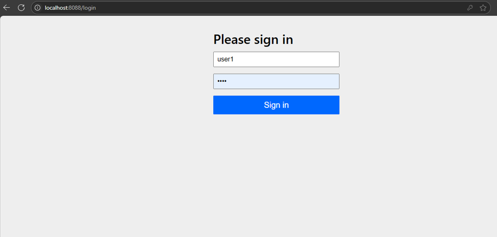
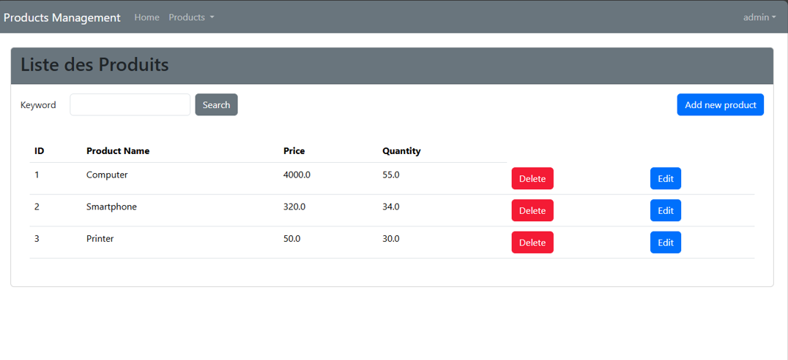
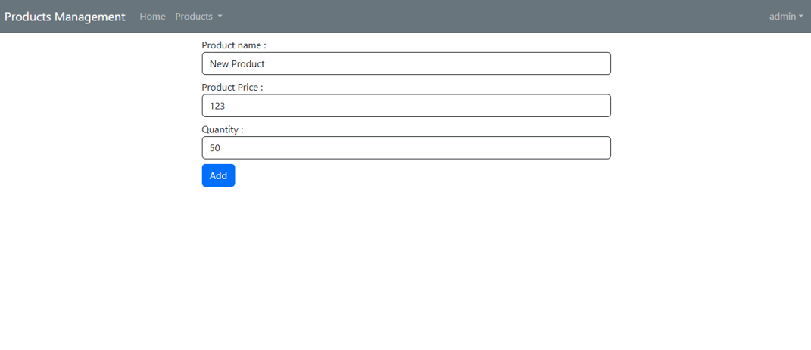
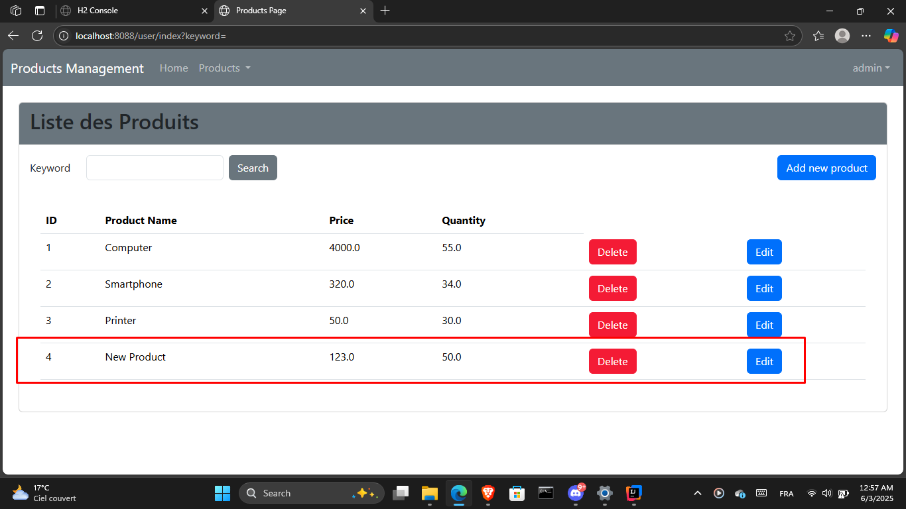
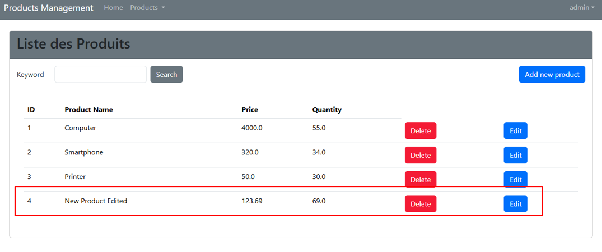
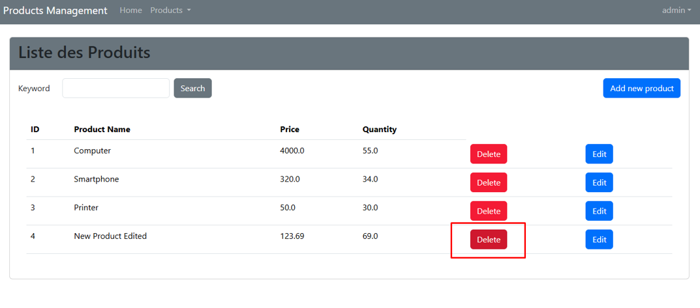
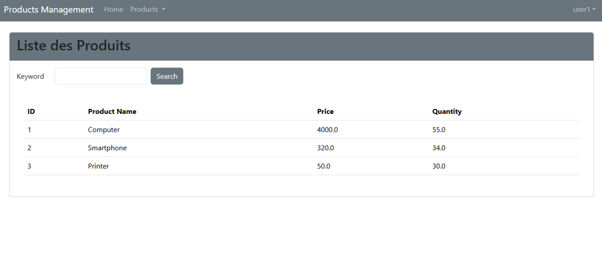
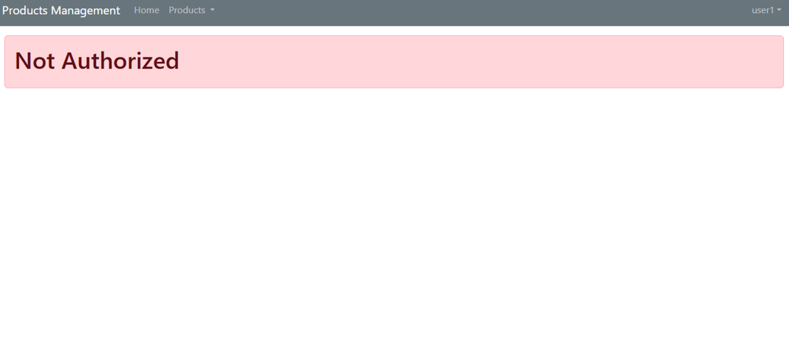

---

## TP N°5 : Gestion des Produits avec Spring MVC

### 🔖 1. Introduction

Ce projet de gestion de produits est une application web construite avec **Spring Boot** et **Thymeleaf**. Elle permet aux utilisateurs de rechercher, ajouter, modifier ou supprimer des produits. Une sécurité basée sur les rôles (`USER` et `ADMIN`) est intégrée pour restreindre l’accès aux différentes fonctionnalités selon le profil de l’utilisateur.

---

### 🗂️ 2. Architecture du Projet

La structure du projet suit l’organisation typique d’une application Spring Boot avec les couches MVC, entités, dépôt de données, sécurité, et vues.

```
src/
└── main/
    ├── java/
    │   └── org/example/products_management_spring_mvc/
    │       ├── ProductsManagementSpringMvcApplication.java
    │       ├── entities/
    │       │   └── Product.java
    │       ├── repositories/
    │       │   └── ProductRepository.java
    │       ├── security/
    │       │   └── SecurityConfig.java
    │       └── web/
    │           ├── ProductController.java
    │           └── SecurityController.java
    └── resources/
        ├── application.properties
        ├── static/
        └── templates/
            ├── addProduct.html
            ├── editProduct.html
            ├── navBar.html
            ├── NotAuthorized.html
            └── Products.html
```

---

### 🧩 3. Détail des Composants

#### 🔹 `ProductsManagementSpringMvcApplication.java`

Fichier principal de démarrage de l’application. Il initialise également quelques données de test dans la base H2.

#### 🔹 `entities/Product.java`

Représente l’entité `Product` avec des annotations JPA et des contraintes de validation.

#### 🔹 `repositories/ProductRepository.java`

Interface JPA qui permet d’interagir avec la base de données. Elle fournit une méthode de recherche personnalisée par nom.

#### 🔹 `security/SecurityConfig.java`

Configure les paramètres de sécurité. Trois utilisateurs sont définis en mémoire avec des rôles différents. L’accès aux routes est protégé selon ces rôles.

#### 🔹 `web/ProductController.java`

Contient les différentes méthodes pour :

* Afficher la liste des produits avec filtrage par mot-clé (`/user/index`)
* Supprimer un produit (`/admin/delete`)
* Afficher le formulaire d’ajout (`/admin/addProduct`)
* Enregistrer un nouveau produit ou une modification (`/admin/save`)

#### 🔹 `web/SecurityController.java`

Gère les redirections en cas d’accès interdit avec la page `/NotAuthorized`.

---

### 🖼️ 4. Interfaces Utilisateur

#### **🔧 Vue `ADMIN`**

* Connexion avec le rôle `ADMIN` :

  

* Affichage et recherche des produits :

  

* Ajout d’un nouveau produit :

  
  

* Modification d’un produit existant :

  
  

* Suppression de produit :

  

---

#### **🔎 Vue `USER`**

* Connexion avec le rôle `USER` :

  

* Accès à la recherche de produits uniquement :

  

* Tentative d’accès à une page restreinte :

  

---

### ⚙️ 5. Configuration de l’Application

#### Fichier `application.properties`

```properties
spring.application.name=products_management_spring_mvc
spring.datasource.url=jdbc:h2:mem:products-DB
spring.datasource.username=sa
spring.jpa.hibernate.ddl-auto=update
server.port=8088
spring.h2.console.enabled=true
```

---

### 🔐 6. Gestion de la Sécurité

* Mise en place de Spring Security avec stockage en mémoire.
* Rôles définis :

  * `USER` : accès en lecture uniquement.
  * `ADMIN` : autorisé à ajouter, modifier, et supprimer.
* Redirection automatique vers une page d’erreur en cas d’accès non autorisé.

---